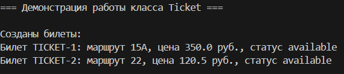
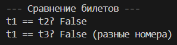
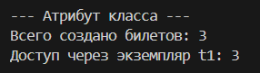
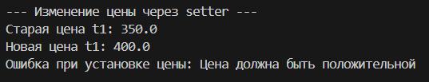
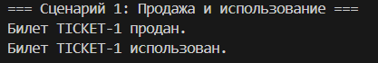
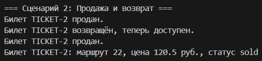
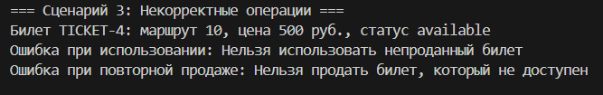
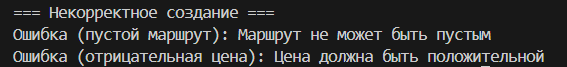

## Лабораторная работа №1

## Схематичный вид класса Ticket

Класс Ticket

Закрытые атрибуты экземпляра:
_number – уникальный номер билета (строка, генерируется автоматически)
_route – номер маршрута (строка)
_price – цена билета (число с плавающей точкой)
_status – текущий статус (строка: "available", "sold", "used")

Атрибуты класса:
total_tickets – общее количество созданных билетов

Методы:
• init(self, route, price) – конструктор с проверкой входных данных (вызов валидации)
• Свойства (геттеры) для чтения: route, price, status, number
• Сеттер для price с валидацией (проверка положительности)
• str() – возвращает понятное пользователю описание билета
• repr() – возвращает официальное представление (как создать объект)
• eq(other) – сравнивает билеты по уникальному номеру
• sell() – продать билет (меняет статус на "sold", только если был "available")
• use() – использовать билет (меняет статус на "used", только если был "sold")
• refund() – вернуть билет (меняет статус на "available", только если был "sold")

Валидация данных вынесена в отдельный модуль validate.py:
– validate_route(route) : проверяет, что маршрут – непустая строка
– validate_price(price) : проверяет, что цена – положительное число
– validate_status(status) : проверяет, что статус допустимый

## Пояснения к классу

**Что представляет собой класс?**  
Класс Ticket моделирует реальный билет на автобус. Он хранит основные данные: номер маршрута, цену, уникальный номер и текущий статус (доступен, продан, использован). С помощью методов можно выполнять действия, соответствующие жизненному циклу билета.

**Почему атрибуты закрытые?**  
Все атрибуты объявлены с одним подчёркиванием (_route, _price, _status, _number), чтобы запретить прямой доступ извне. Это защищает данные от случайного изменения и позволяет контролировать их через свойства и методы. Например, цену нельзя установить отрицательной благодаря проверке в сеттере.

**Какие инварианты (постоянные правила) поддерживаются?**  
- Маршрут не может быть пустой строкой.  
- Цена всегда строго больше нуля.  
- Статус может принимать только одно из трёх значений: `"available"`, `"sold"`, `"used"`.  
- Номер билета генерируется автоматически и уникален в пределах одного запуска программы (счётчик `total_tickets` обеспечивает это на практике).

Эти правила проверяются при создании объекта и при любом изменении соответствующих атрибутов.

**Когда два билета считаются одинаковыми?**  
Два билета равны только тогда, когда у них совпадают уникальные номера (`_number`). Даже если маршрут и цена совпадают, это разные билеты (как в реальной жизни). Поэтому в методе `__eq__` сравниваются именно номера.

**Как состояние влияет на поведение?**  
Поведение объекта зависит от его текущего статуса:  
- `sell()` разрешён только при статусе `"available"`.  
- `use()` разрешён только при статусе `"sold"`.  
- `refund()` разрешён только при статусе `"sold"`.  

Если метод вызывается в неподходящем статусе, возникает исключение `ValueError` с пояснением. Это демонстрирует **поведение, зависящее от состояния**.

**Откуда берётся валидация?**  
Все проверки вынесены в отдельный модуль `validate.py`. Это позволяет:  
- не загромождать основной класс;  
- переиспользовать функции проверок в других частях программы (если потребуется);  
- легко изменять правила валидации в одном месте.

## Пример реализации кода

Создание билетов

Сравнение билетов

Атрибут класса

Изменение цены через setter

Сценарий 1: Продажа и использование

Сценарий 2: Продажа и возврат

Сценарий 3: Некорректные операции

Некорректное создание

